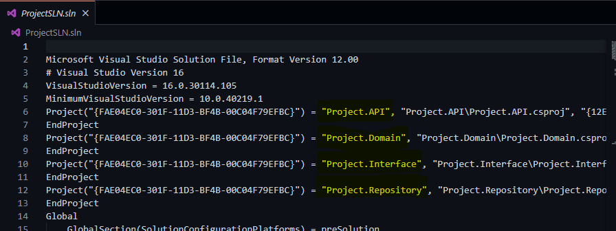
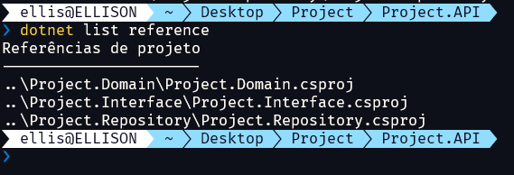
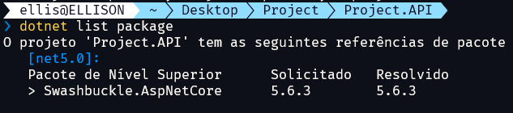
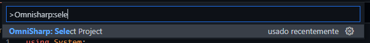
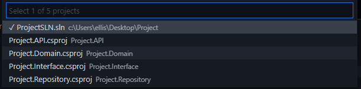

# Criando projetos (classlib e webapi) adicionando suas referências e conectando a *Solution* (SLN)

Criador por **Ellison W. M. Guimarães**

**LinkedIn**: https://www.linkedin.com/in/ellisonguimaraes/

**E-mail**: [ellison.guimaraes@gmail.com](mailto:ellison.guimaraes@gmail.com)

Quando criamos uma *Solution* (SLN) com vários projetos dentro, sejam eles *webapi*, *classlib*, etc, é necessários informar ao *solution* que existem esses projetos. Além disso, precisamos adicionar as referências de um projeto a outros.

Para exemplificar, iremos criar inicialmente uma *Solution*:

```shell
dotnet new sln --name "ProjectSLN"
```

Também criaremos mais quatro projetos nesta mesma pasta, três deles são *classlib* e um *webapi*:

```C#
dotnet new classlib -o "Project.Domain"
dotnet new classlib -o "Project.Interface"
dotnet new classlib -o "Project.Repository"
dotnet new webapi -o "Project.API"
```

Após criamos a *solution* e os projetos o nosso diretório fica da seguinte forma: 

```
├───ProjectSLN.sln
│
├───Project.API
│   │   appsettings.Development.json
│   │   appsettings.json
│   │   Program.cs
│   │   Project.API.csproj
│   │   Startup.cs
│   │   WeatherForecast.cs
│   │
│   ├───Controllers
│   │       WeatherForecastController.cs
│   │
│   └───Properties
│           launchSettings.json
│
├───Project.Domain
│   │   Class1.cs
│   │   Project.Domain.csproj
│
├───Project.Interface
│   │   Class1.cs
│   │   Project.Interface.csproj
│
└───Project.Repository
    │   Class1.cs
    │   Project.Repository.csproj
```

Agora precisamos fazer as conexões entre os projetos, que até então, estão totalmente independentes. 


## Configurando os projetos na *solution* (SLN)

Para adicionar os projetos a *solution* usando o comando `dotnet sln add`, onde após o `add` colocamos os respectivos arquivos `.csproj` de cada projeto. Abaixo vamos adicionar os projetos:

```c#
dotnet sln add .\Project.API\Project.API.csproj
dotnet sln add .\Project.Domain\Project.Domain.csproj
dotnet sln add .\Project.Interface\Project.Interface.csproj
dotnet sln add .\Project.Repository\Project.Repository.csproj
```

A partir deste momento podemos verificar que no arquivo *sln* estão incluídos:




## Referenciando projetos a outros

Cada um dos projetos precisam referenciar outros, e para isso utilizamos o comando `dotnet add reference [file.csproj]` também referenciando o arquivo `csproj` dos outros projetos, por exemplo: 

- O projeto `Project.Interface` precisa da referência para o projeto `Project.Domain`, precisamos então ir até o diretório de `Project.Interface` e usar o comando:

    ```C#
    dotnet add reference ..\Project.Domain\Project.Domain.csproj
    ```

- O projeto `Project.Repository` precisa da referência para o projeto `Project.Domain` e `Project.Interface`, precisamos então ir até o diretório de `Project.Repository` e usar os comandos:

    ```C#
    dotnet add reference ..\Project.Domain\Project.Domain.csproj
    dotnet add reference ..\Project.Interface\Project.Interface.csproj
    ```

- O projeto `Project.API` precisa da referência para todos os outros três projetos, logo, precisamos ir até o diretório do `Project.API` e usar todos os comandos:

    ```C#
    dotnet add reference ..\Project.Domain\Project.Domain.csproj
    dotnet add reference ..\Project.Interface\Project.Interface.csproj
    dotnet add reference ..\Project.Repository\Project.Repository.csproj
    ```


> É possível visualizar as referencias de um projeto usando o comando `dotnet list reference`. Veja o exemplo do comando no projeto `Project.API`:
>
> 
>
> Não confunda com `dotnet list package`, que mostram os pacotes:
>
> 


## Selecionando o projeto no VSCode para uso do Intellisense

Para selecionar o arquivo `csproj` no Visual Studio Code, é necessário:

- Acessar o menu com `Ctrl + Shift + P`;

- Digitar por `OmniSharp: Select Project`:

    

- Selecionar o projeto que deseja utilizar o *intellisense*:

    

    > Podemos utilizar o *Intelissense* em um projeto em específico ou podemos utilizar a *solution* geral que engloba todos os projetos, no qual é o mais recomendado.

